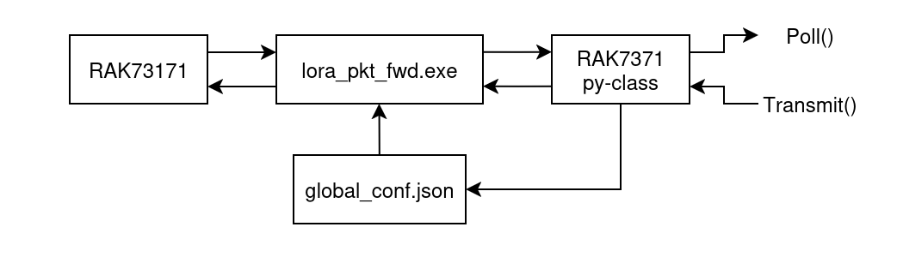

# RAK7131 python interface

### Getting started 
Currently the interface relies on the lora_pkt_fwd executable provided by https://github.com/Lora-net/sx1302_hal

For more info this guide for linux is recommended https://docs.rakwireless.com/product-categories/wisgate/rak7271-rak7371/quickstart/


A python class have been developed that acts as a server for the packet forwarder provided by samtech.




Initialization of the RAK7371 interface


```python
RAK7371.setup_auto()
```
Setup auto tries to automatically detect the what COM-port the RAK7371 is connected to and starts the packet forwarder as a background task.

```python
RAK7371.setup_manual(path: str)
```
Manual setup lets you specifiy what COM-port to uses and handles the exe file in the background

```python
RAK7371._Setup_socket()
```
Lets you run the packet forwarder externally to be able to view the log, for this the global_conf.json must be set manually.


Packets are sent via a socket for which the required acknowdleges are handled by the RAK7371 class. 
Two relevant packages recieved in the json format is the `rxpk` and the `stat` package

The `poll()` method returns a deserialized json object for which the following paramters can exist for the rxpk

| Name | Type   | Function |
|------|--------|----------|
| time | string | UTC time of pkt RX, us precision, ISO 8601 'compact' format |
| tmms | number | GPS time of pkt RX, number of milliseconds since 06.Jan.1980 |
| tmst | number | Internal timestamp of "RX finished" event (32b unsigned) |
| ftime | number | fine timestamp, number of nanoseconds since last PPS [0..999999999] (Optional) |
| freq | number | RX central frequency in MHz (unsigned float, Hz precision) |
| chan | number | Concentrator "IF" channel used for RX (unsigned integer) |
| rfch | number | Concentrator "RF chain" used for RX (unsigned integer) |
| mid  | number | Concentrator modem ID on which pkt has been received |
| stat | number | CRC status: 1 = OK, -1 = fail, 0 = no CRC |
| modu | string | Modulation identifier "LORA" or "FSK" |
| datr | string | LoRa datarate identifier (eg. SF12BW500) |
| datr | number | FSK datarate (unsigned, in bits per second) |
| codr | string | LoRa ECC coding rate identifier |
| rssi | number | RSSI of the channel in dBm (signed integer, 1 dB precision) |
| rssis| number | RSSI of the signal in dBm (signed integer, 1 dB precision) |
| lsnr | number | Lora SNR ratio in dB (signed float, 0.1 dB precision) |
| foff | number | LoRa frequency offset in Hz (signed interger) |
| size | number | RF packet payload size in bytes (unsigned integer) |
| data | string | Base64 encoded RF packet payload, padded |


For the Stat package the following parameters can exist

| Name | Type   | Function                                                     |
| ---- | ------ | ------------------------------------------------------------ |
| time | string | UTC 'system' time of the gateway, ISO 8601 'expanded' format |
| lati | number | GPS latitude of the gateway in degree (float, N is +)        |
| long | number | GPS latitude of the gateway in degree (float, E is +)        |
| alti | number | GPS altitude of the gateway in meter RX (integer)            |
| rxnb | number | Number of radio packets received (unsigned integer)          |
| rxok | number | Number of radio packets received with a valid PHY CRC        |
| rxfw | number | Number of radio packets forwarded (unsigned integer)         |
| ackr | number | Percentage of upstream datagrams that were acknowledged      |
| dwnb | number | Number of downlink datagrams received (unsigned integer)     |
| txnb | number | Number of packets emitted (unsigned integer)                 |
| temp | number | Current temperature in degree Celsius (float)                |

Typical examples for rx packages are
```json
{"rxpk":[
	{
		"tmst":3512348611,
		"time":"2020-10-01T09:30:52.592567Z",
		"tmms":1285579871592,
		"ftime":85224290,
		"chan":2,
		"rfch":0,
		"freq":866.349812,
		"mid":3,
		"stat":1,
		"modu":"LORA",
		"datr":"SF7BW125",
		"codr":"4/6",
		"rssi":-35,
		"lsnr":5.1,
		"foff":-3313,
		"size":32,
		"data":"-DS4CGaDCdG+48eJNM3Vai-zDpsR71Pn9CPA9uCON84"
	}
]}
```

And likewise the status packages can be seen as the following
```json
{"stat":{
    "time":"2014-01-12 08:59:28 GMT",
    "lati":46.24000,
    "long":3.25230,
    "alti":145,
    "rxnb":2,
    "rxok":2,
    "rxfw":2,
    "ackr":100.0,
    "dwnb":2,
    "txnb":2,
    "temp": 23.2
}}
```
